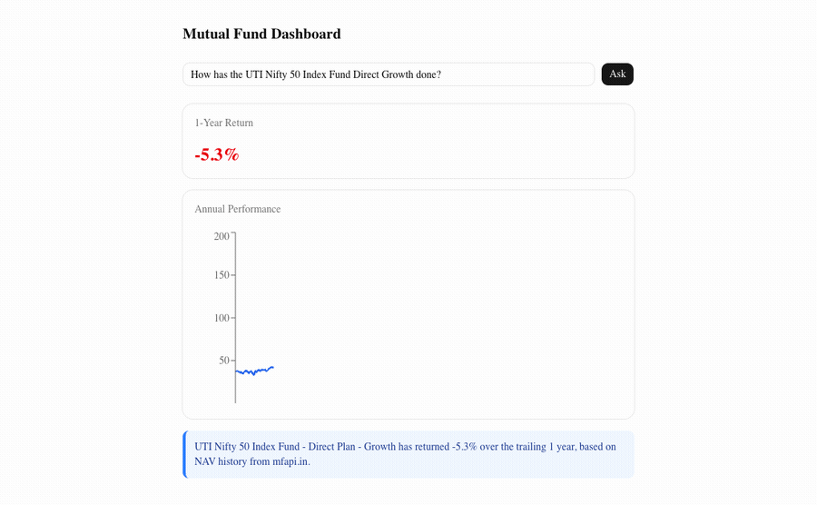
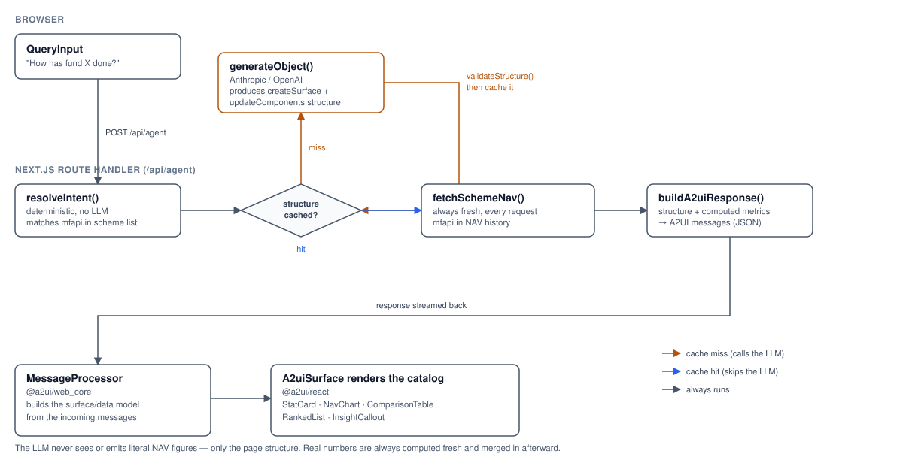

# A2UI Mutual Fund Dashboard

A Next.js demo applying the A2UI (Agent-to-UI) declarative generative UI
pattern to natural-language analysis of Indian mutual funds.



## Architecture

See [docs/adr/0001-mutual-fund-a2ui-dashboard-architecture.md](docs/adr/0001-mutual-fund-a2ui-dashboard-architecture.md)
for the full architecture decision record, including why the app skips the
AG-UI/CopilotKit runtime, why it uses fixed-schema-per-intent caching, and
why the LLM never sees or emits literal financial figures.



The LLM is only ever asked to produce *structure* (which of the five catalog
components to show and how they're bound to data paths) — never to see or
emit a literal NAV figure or return percentage. Those are always computed
deterministically from fresh `mfapi.in` data and merged in afterward, whether
the structure came from a fresh LLM call or the cache.

## Setup

```bash
npm install
cp .env.example .env.local  # then fill in ANTHROPIC_API_KEY or OPENAI_API_KEY
npm run dev
```

If your shell already exports `ANTHROPIC_BASE_URL`/`OPENAI_BASE_URL` for a
local LLM workflow (e.g. Ollama), unset them before running `npm run dev`,
or they will silently redirect this app's API calls to your local server
instead of the real Anthropic/OpenAI API. `.env.local` cannot override an
already-exported shell variable of the same name.

## Testing

```bash
npm test
```

## Data source

[mfapi.in](https://www.mfapi.in/) — free, unauthenticated, unrated-limited
NAV history and scheme metadata for Indian mutual funds. No holdings,
expense ratio, or AUM data is available, so "analysis" here means
NAV-history-derived metrics, not portfolio composition. The app currently
surfaces trailing returns (1M/3M/1Y/3Y/5Y); `lib/metrics.ts` also implements
CAGR, annualized volatility, and max drawdown (tested, but not yet wired
into any catalog component).

Real scheme names always carry both a plan qualifier (Direct/Regular Plan)
and an option qualifier (Growth/IDCW/Dividend Option) — e.g. "HDFC Flexi
Cap Fund - Direct Plan - Growth Option". Naming just the fund in a query
resolves to the Direct + Growth variant by default, since that's the
combination "how has this fund done" conventionally refers to.
