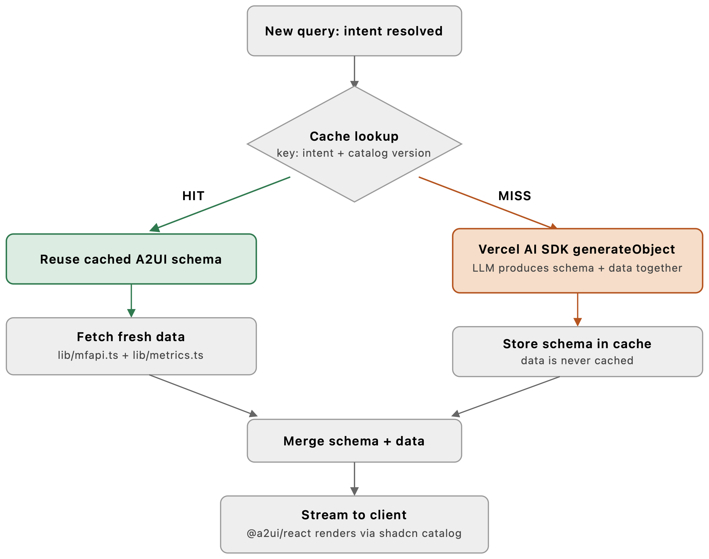
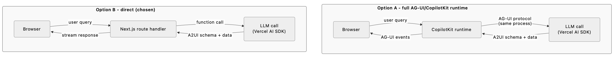

# ADR-0001: A2UI-Based AI Dashboard for Mutual Fund Analysis

**Status:** Proposed
**Date:** 2026-09-24
**Deciders:** Akash Pal

## Context

The goal is a personal demo/prototype: a Next.js application that applies the A2UI (Agent-to-UI) declarative generative UI pattern to a real, if narrow, use case — natural-language analysis of Indian mutual funds. It exists to make the A2UI approach concrete and demonstrable, not to be a production investment tool.

Three things shape every decision below:

1. **It's a demo, not a product.** No auth, no multi-tenancy, single user. Favor fast iteration and clarity of the A2UI pattern over production hardening.
2. **Data is free and unauthenticated but narrow.** [mfapi.in](https://www.mfapi.in/) gives NAV (Net Asset Value) history and basic scheme metadata for 10,000+ Indian mutual fund schemes, no API key, no rate limit, updated 6x/day. It does **not** provide holdings, expense ratio, or AUM. "Analysis" is therefore necessarily NAV-history-derived: trailing returns, volatility, drawdown, category-relative comparison — not portfolio composition or cost analysis.
3. **The point is to exercise declarative generative UI, not chat.** The interesting architectural surface is: agent resolves intent → agent picks/composes a UI from a fixed component catalog → agent fills it with computed data → client renders it. A plain chatbot that prints numbers would miss the point of the exercise.

## Decision

Build a single Next.js (App Router, TypeScript) application with:

- **Vercel AI SDK** (provider-agnostic) as the sole agent/LLM layer — no separate agent backend, so no cross-process transport protocol is needed.
- **`@a2ui/react`** as the declarative UI renderer — the actively-maintained reference implementation of the A2UI spec (see research below), used headlessly against our own component catalog.
- **shadcn/ui + Tailwind**, with TanStack Table and Recharts, as the design system and component catalog implementation.
- A small **fixed catalog of five components** (`StatCard`, `NavChart`, `ComparisonTable`, `RankedList`, `InsightCallout`), with the agent **dynamically composing** which ones appear and in what order per query — dynamic schema, bounded by a fixed catalog, which is deliberately the middle ground the A2UI spectrum argues for.
- A **schema cache** (in-memory for the demo) keyed on resolved intent + catalog version, separating the reusable *structure* the LLM produces from the *data* that's recomputed every request — the same caching pattern documented for A2UI generally, scoped down for a single-user app (no tenant/role dimension needed here, but the key is designed so those can be added later without a redesign).

*On a cache hit, the LLM is skipped entirely and only data is refetched; on a miss, the LLM produces schema and data together and the schema — never the data — is what gets persisted for next time.*

## Options Considered

### Option A: Full AG-UI/CopilotKit runtime + A2UI on top

Use CopilotKit's official `@copilotkit/react-core` / `@copilotkit/runtime` packages (AG-UI protocol) as the transport layer between frontend and agent, with A2UI-shaped payloads carried over it.

| Dimension | Assessment |
|---|---|
| Complexity | Higher — adds a runtime abstraction and its own event model on top of Next.js's native request/streaming |
| Cost | None (open source) |
| Scalability | Not relevant at demo scale; AG-UI's value is decoupling frontend from a *separate* agent backend (Python/LangChain/ADK/etc.) |
| Team familiarity | New surface area to learn for no immediate payoff |

**Pros:** Matches the phrase "official A2UI/AG-UI SDK" literally; positions the app to swap in a non-JS agent backend later with no frontend rewrite.
**Cons:** AG-UI solves a problem this app doesn't have — there is no separate backend in a different language/process. It would be protocol overhead wrapping a same-process function call.

### Option B: Vercel AI SDK direct + `@a2ui/react` only (recommended)

Keep the agent as a Next.js route handler calling the Vercel AI SDK directly (streaming `generateObject`/`streamObject` against a Zod schema shaped like an A2UI response). Use `@a2ui/react` purely for the rendering half.

| Dimension | Assessment |
|---|---|
| Complexity | Lower — one streaming layer (Vercel AI SDK), one rendering layer (`@a2ui/react`) |
| Cost | None |
| Scalability | Sufficient for a single-process demo; the schema layer is unchanged if a real backend split happens later |
| Team familiarity | Vercel AI SDK is already the chosen LLM layer; no new protocol to learn |

**Pros:** Every layer does one job, nothing is present "because the name matched." Still uses the genuinely official A2UI renderer.
**Cons:** If the project ever needs a separate non-Next.js agent backend, AG-UI would need to be added at that point (low cost — it's additive, not a rewrite, since it wraps the same schema).

### Option C: Build a custom lightweight schema renderer instead of `@a2ui/react`

Skip third-party A2UI packages entirely; hand-roll a small schema-to-component mapper.

| Dimension | Assessment |
|---|---|
| Complexity | Lowest short-term, but reinvents what `@a2ui/react` already does well |
| Cost | None |
| Scalability | Fine for a demo, but drifts from the actual spec over time |
| Team familiarity | Full control, no dependency to learn |

**Pros:** Zero dependency risk, maximum control.
**Cons:** Defeats the stated purpose of the exercise — the point is to apply the real A2UI approach, and the research below shows the real renderer is mature enough (69K weekly downloads, published days ago, Google-affiliated maintainer) that hand-rolling isn't buying meaningfully more safety.

*Option A inserts a runtime and a protocol translation (CopilotKit + AG-UI events) between the browser and an LLM call that never leaves the same process; Option B reaches it directly. That extra hop is the entire cost/benefit this decision turns on.*

**Decision: Option B.** Full package research is in the Trade-off Analysis section.

## Trade-off Analysis

**Why the "official SDK" framing needs unpacking.** A2UI and AG-UI are commonly mentioned together but solve different problems (confirmed directly from CopilotKit's own AG-UI page): AG-UI is "the general-purpose, bi-directional connection between a user-facing application and any agentic backend" (a transport/runtime protocol); A2UI is "a generative UI specification... which agents can use to deliver UI widgets" (a schema). They're described as complementary, not redundant, but that also means adopting one doesn't require adopting the other.

**Package research (npm registry, checked 2026-09-24):**

| Package | Latest version | Last published | Weekly downloads | Notes |
|---|---|---|---|---|
| `@a2ui/react` | 0.11.1 | 2026-09-12 | 69,299 | Repo: `a2ui-project/a2ui`, homepage `a2ui.org`. Maintainer list includes `a2ui-owners@google.com`. Peer deps: React 18/19, Zod. This is the closest thing to an official reference renderer. |
| `@a2ui-sdk/react` | 0.4.0 | 2026-02-02 | — | 7 months stale relative to `@a2ui/react`; less actively maintained. |
| `@xpert-ai/a2ui-react` | 0.1.0 | 2026-04-17 | — | Notable for shipping shadcn-style components out of the box, but a single early release — higher abandonment risk. |
| `@copilotkit/react-core` | 1.73.3 | 2026-09-22 | 310,746 | Mature, very actively maintained, but solves the AG-UI (transport) problem, not the A2UI (schema) problem. |

The spec itself is at **v0.9.1 (production)**, with **v1.0 at candidate status** per a2ui.org — young, but past the "may change weekly" stage, and `@a2ui/react`'s headless, catalog-driven design (register your own styled components; the renderer only decides *which* one and *what data*) insulates the app from most spec churn: as long as component names and prop shapes stay stable, upstream version bumps shouldn't require rewrites.

**Why shadcn/ui over Mantine or Ant Design for the catalog:** `@a2ui/react`'s catalog model wants plain components with predictable props, which is exactly shadcn/ui's shape (copy-in React + Tailwind, no theme-provider indirection). It also happens to be where the surrounding agent-UI ecosystem is converging (`@xpert-ai/a2ui-react` ships shadcn-style components by default). Mantine and Ant Design are both reasonable design systems in isolation, but each brings its own styling/theming layer that adds a translation step between "the agent picked component X with props Y" and "render it," for no benefit this app needs.

**Why dynamic schema, not fixed, for this specific demo:** the whitepaper on this same A2UI approach argues fixed schema is the safer enterprise default, and that's still true here for any *single* view. But the thing worth demonstrating in a personal exploration of A2UI is exactly the part enterprises use carefully: the agent choosing *which combination* of approved components answers a given question. A fixed single-schema app would prove less about the pattern. The catalog stays small and fixed (five components); only their selection and arrangement is dynamic.

## Consequences

- **Easier:** rendering is decoupled from the LLM call — the same catalog components can be reused verbatim if the agent logic changes later (different model, different prompt strategy, even a different framework driving the schema).
- **Easier:** because there's no separate agent backend, deployment is a single Vercel (or equivalent) Next.js deployment — no second service to run or version alongside the frontend.
- **Harder:** "analysis" is capped by what mfapi.in actually exposes (NAV history + basic metadata). Any feature implying holdings, expense ratio, or AUM comparison needs a second data source later — explicitly out of scope for v1.
- **Harder:** the in-memory schema cache resets on every deploy/restart and isn't shared across serverless instances. Fine for a demo; would need Vercel KV/Redis before this became a real multi-user tool.
- **Revisit later:** if a non-JS agent backend is ever introduced (e.g. moving the agent to a Python service), add AG-UI at that point — the A2UI schema contract shouldn't need to change, only the transport.

## Action Items

1. [ ] Scaffold Next.js 15 (App Router, TypeScript) project with Tailwind + shadcn/ui initialized
2. [ ] Build `lib/mfapi.ts`: typed client for scheme search (`GET https://api.mfapi.in/mf`) and per-scheme NAV history (`GET https://api.mfapi.in/mf/{schemeCode}`)
3. [ ] Build `lib/metrics.ts`: trailing return (1M/3M/1Y/3Y/5Y), CAGR, volatility, max drawdown from a raw NAV series
4. [ ] Define the five-component catalog (`StatCard`, `NavChart`, `ComparisonTable`, `RankedList`, `InsightCallout`) as shadcn-based React components with matching Zod schemas
5. [ ] Wire `@a2ui/react`'s catalog registration against those five components
6. [ ] Build the agent route handler: resolve intent → check schema cache → on miss, call Vercel AI SDK (`generateObject`/`streamObject`) to produce an A2UI-shaped response referencing the catalog → on hit, reuse cached schema and recompute data only
7. [ ] Build the query UI (single input + rendered A2UI surface below it)
8. [ ] Smoke-test the three flagship queries: single-fund lookup, multi-fund comparison, category ranking
9. [ ] Write `README.md` documenting the architecture decisions from this ADR for anyone reading the repo as a reference implementation
